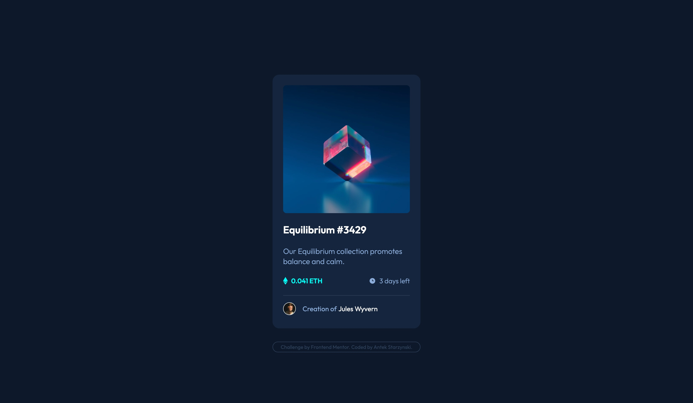

# Frontend Mentor - NFT preview card component solution

This is a solution to the [NFT preview card component challenge on Frontend Mentor](https://www.frontendmentor.io/challenges/nft-preview-card-component-SbdUL_w0U). Frontend Mentor challenges help you improve your coding skills by building realistic projects. 

### Screenshot

### Links

- Solution URL: [click here](https://github.com/antonistarzynski/nft-preview-card-component-main)
- Live Site URL: [click here](https://antonistarzynski.github.io/nft-preview-card-component-main/)

### Built with

- Semantic HTML5 markup
- CSS custom properties
- Flexbox

## Author

- Website - [Antek Starzynski](https://www.antekstarzynski.com)
- Frontend Mentor - [@antonistarzynski](https://www.frontendmentor.io/profile/antonistarzynski)

